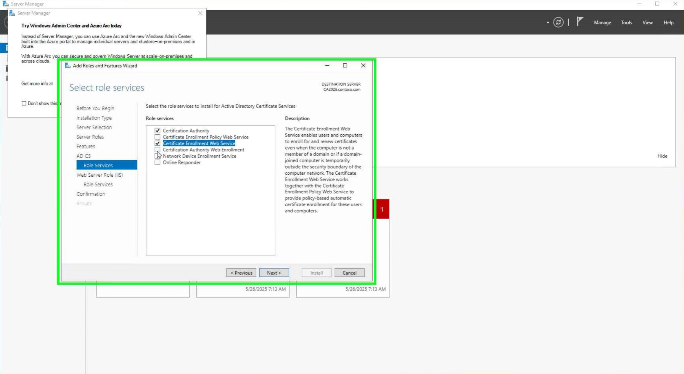

# CA (Certificate Authority) in Windows Active Directory
## Overview
A Certificate Authority (CA) in Windows Active Directory (AD) is a server that issues and manages digital certificates as part of a Public Key Infrastructure (PKI) environment. These certificates are used for securing communications, authenticating users and devices, enabling smart card logon, securing email, and more.

## CA01

## CA02

## CA03

## CA04

## CA05

## CA06

## CA07

## CA08

## CA09

## CA10

## CA11

## CA12

## CA13

## CA14

## CA15

## CA16

## CA17

## CA18

## Configuration Steps (High-Level)

1. **Install AD Certificate Services Role:** Use Server Manager or PowerShell to add the CA role.
2. **Configure CA Type:** Choose between Enterprise or Standalone, Root or Subordinate.
3. **Set up Certificate Templates:** Define templates for different certificate types.
4. **Publish CRLs and AIA:** Ensure clients can check certificate status.
5. **Request and Issue Certificates:** Users, computers, and services request certificates using the appropriate template.
6. **Manage and Monitor the CA:** Regularly audit issuance, renew CA certificates, and manage revocation.

## References
## Types of Certificate Authorities
- **Root CA:** The top-level CA that is trusted by clients and other CAs. It signs its own certificate.
- **Subordinate/Issuing CA:** A CA that is trusted by the Root CA and issues certificates to users, computers, and services.
- **Enterprise CA:** Integrated with Active Directory, can issue certificates to AD users and devices automatically.
- **Standalone CA:** Not integrated with Active Directory, requires manual approval for certificate requests.

## Common Use Cases
- Secure internal web services (SSL/TLS).
- Smart card or certificate-based user authentication.
- Code signing and secure email (S/MIME).
- Network access control (802.1x) and VPN authentication.
- Device authentication for domain-joined computers.

- [Microsoft Certificate Services Documentation](https://learn.microsoft.com/en-us/windows-server/certmgr/)
- [AD CS Best Practices](https://learn.microsoft.com/en-us/windows-server/certmgr/certificate-authority-best-practices)
