# CA (Certificate Authority) in Windows Active Directory
## Overview
A Certificate Authority (CA) in Windows Active Directory (AD) is a server that issues and manages digital certificates as part of a Public Key Infrastructure (PKI) environment. These certificates are used for securing communications, authenticating users and devices, enabling smart card logon, securing email, and more.

# Installing the Certificate Authority Role in Windows Server

This guide walks you through the process of installing the Active Directory Certificate Services (AD CS) role using the Add Roles and Features Wizard in Windows Server.

---

## 1. Launch Add Roles and Features Wizard
Open the Server Manager and select **Add Roles and Features** to begin the setup process.

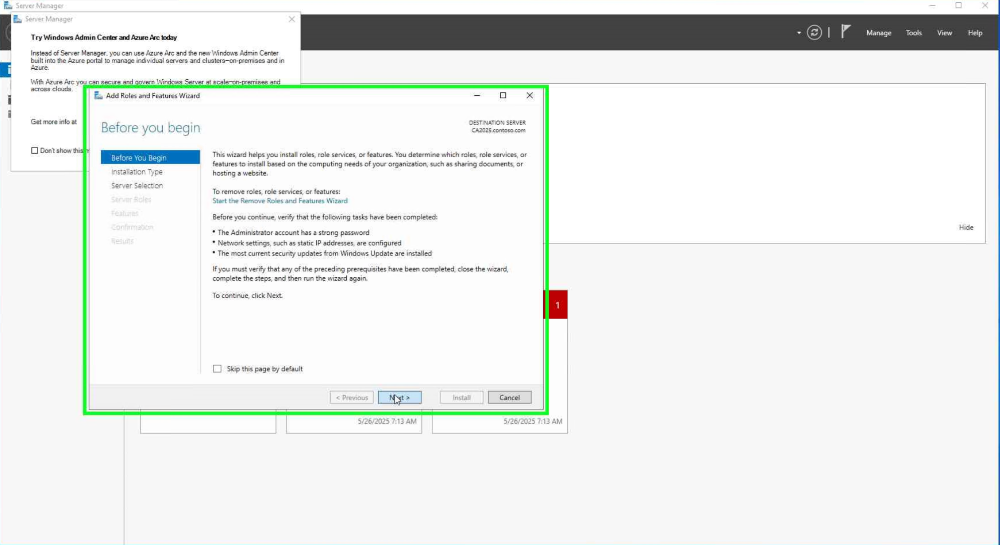

---

## 2. Start the Wizard
Proceed through the initial welcome screen of the Add Roles and Features Wizard.

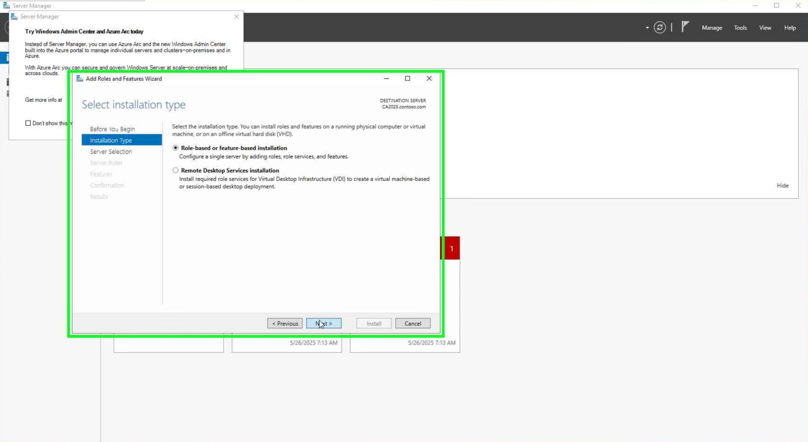

---

## 3. Select Destination Server
Choose **Select a server from the server pool** and pick the server where you want to install the role.

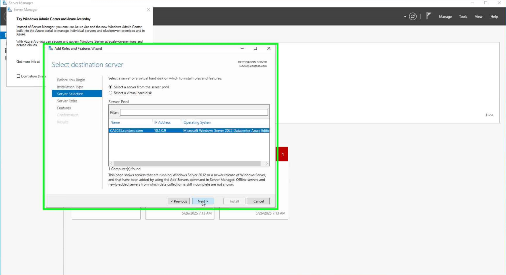

---

## 4. Select Server Roles
In the **Server Roles** list, check **Active Directory Certificate Services**.

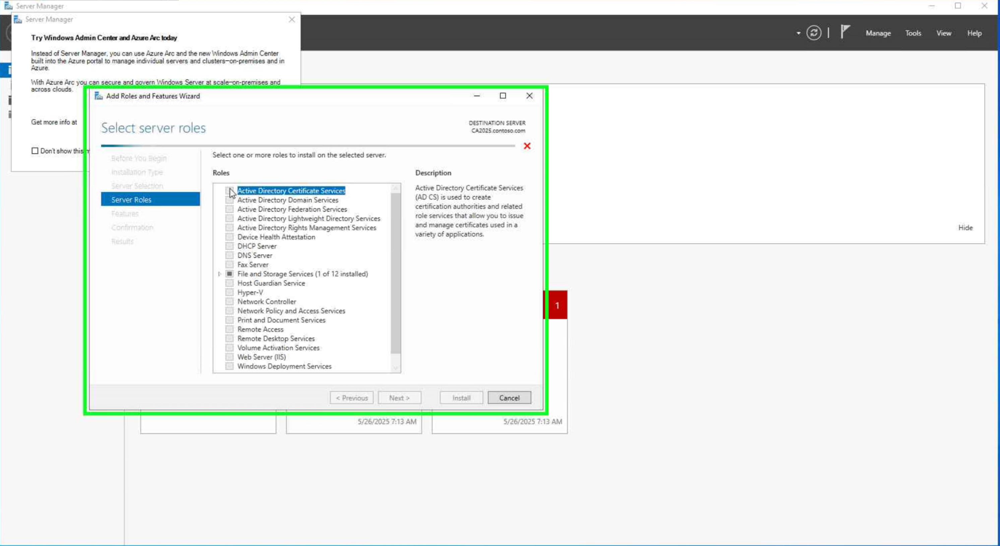
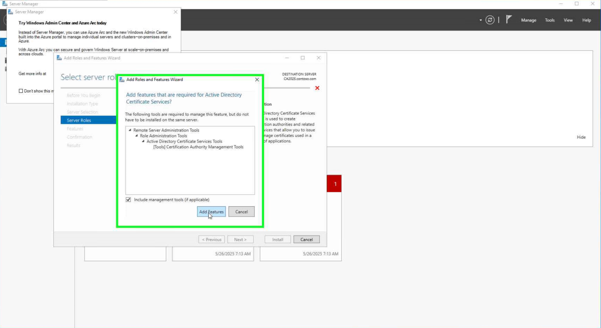
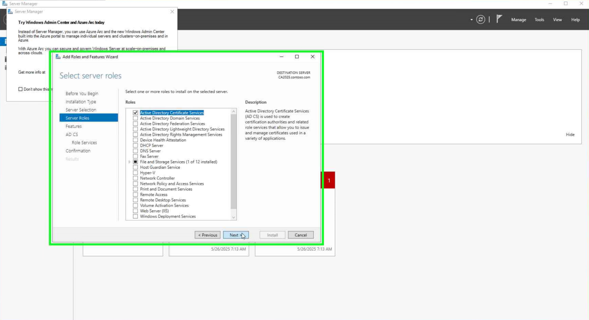

---

## 5. Select Role Features (keep default)
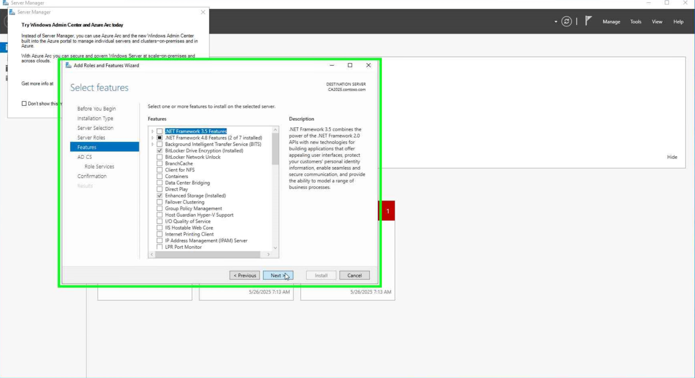

## 6. Select Role Services
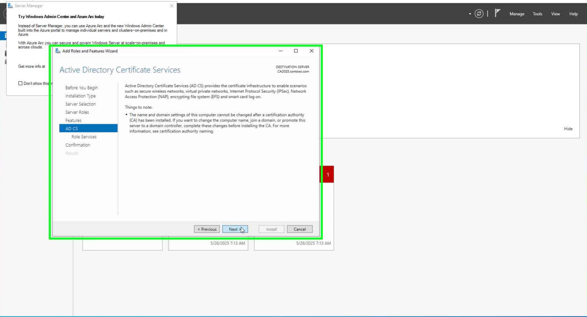

Select **Certification Authority** for certificate issue

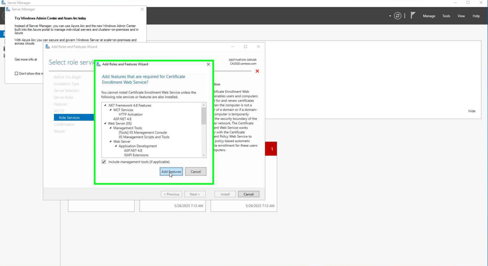

Select **Certificate Enrollment Web Service** to enable web-based certificate enrollment.

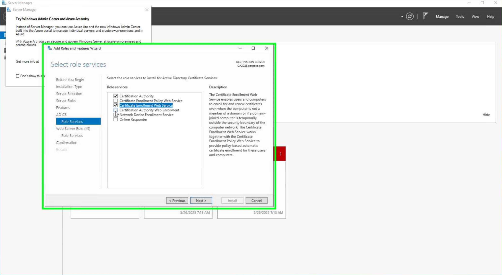

Select **Certification Authority Web Enrollment** for web-based CA requests.
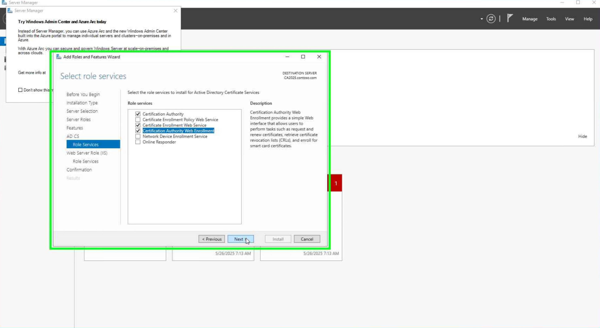
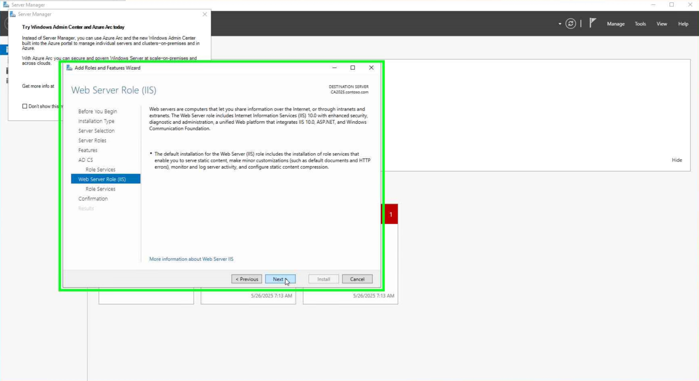
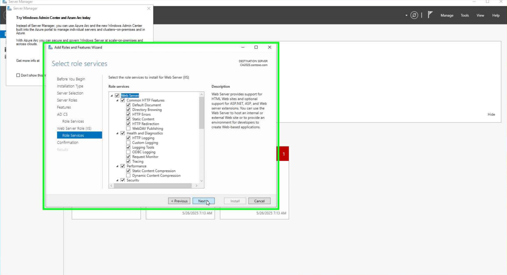

---

## 6. Install the Roles and Features
Click **Install** to begin the installation process.

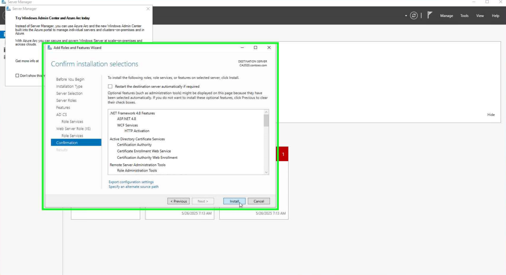

---

## 7. Complete the Installation
Once the installation is finished, click **Close** to exit the wizard.

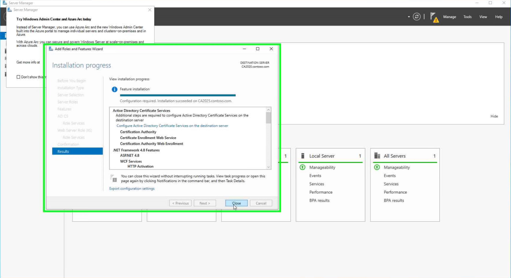

---
## Configuration Steps (High-Level)

1. **Install AD Certificate Services Role:** Use Server Manager or PowerShell to add the CA role.
2. **Configure CA Type:** Choose between Enterprise or Standalone, Root or Subordinate.
3. **Set up Certificate Templates:** Define templates for different certificate types.
4. **Publish CRLs and AIA:** Ensure clients can check certificate status.
5. **Request and Issue Certificates:** Users, computers, and services request certificates using the appropriate template.
6. **Manage and Monitor the CA:** Regularly audit issuance, renew CA certificates, and manage revocation.

## References
## Types of Certificate Authorities
- **Root CA:** The top-level CA that is trusted by clients and other CAs. It signs its own certificate.
- **Subordinate/Issuing CA:** A CA that is trusted by the Root CA and issues certificates to users, computers, and services.
- **Enterprise CA:** Integrated with Active Directory, can issue certificates to AD users and devices automatically.
- **Standalone CA:** Not integrated with Active Directory, requires manual approval for certificate requests.

## Common Use Cases
- Secure internal web services (SSL/TLS).
- Smart card or certificate-based user authentication.
- Code signing and secure email (S/MIME).
- Network access control (802.1x) and VPN authentication.
- Device authentication for domain-joined computers.

- [Microsoft Certificate Services Documentation](https://learn.microsoft.com/en-us/windows-server/certmgr/)
- [AD CS Best Practices](https://learn.microsoft.com/en-us/windows-server/certmgr/certificate-authority-best-practices)
